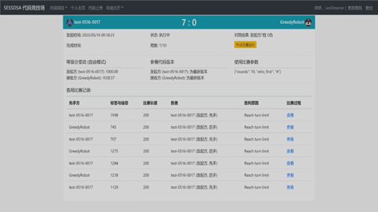

## <p align=center> **2023春季学期 数据结构与算法(B)<br>大作业“星际消战” 第九组报告** </p>

<p align=right> 
组长：程子劼<br>
组员：谢佳芯 原梓轩 李婉钰 黄麟哲<br>
</p>

本学期大作业主题围绕传统“开心消消乐”游戏展开。  
游戏中，双方玩家将轮流在主棋盘中交换一对相邻棋子，通过交换棋子, 使三个及以上同色棋子在水平或垂直方向相连，消除得分；同色相连涉及的连通区域越大，得分越高；消除后产生的空位由上方储备棋盘掉落棋子填充。完成指定回合数，分高者得胜。

注：由于导出PDF编辑局限性，不能很好的支持相对路径，因此以下文章的超链接采用GitHub外链形式。若由于网络问题导致超链接访问失败，可参看随报告一并打包发送的文件，其内已包含所有相关资料。

------
### **（一）成员分工**

- 组长：程子劼
- 编程：原梓轩，程子劼
- 测试：原梓轩，程子劼
- 协助建议：黄麟哲，谢佳芯
- 报告撰写：李婉钰，谢佳芯
- 编辑：原梓轩，程子劼，黄麟哲

------
### **（二） 集体讨论记录**

**# 准备阶段**
- 时间：2023/04/25-2023/05/09
- 方式：线上交流
- 相关资料：[第一份草稿](https://github.com/LeoDreamer2004/DSA2023/blob/main/draft_1.ipynb)
- 准备过程：
    1. 自学 `Numpy` 库，随时关注源代码的更新、理解 `Board.py`；
    2. 初步形成贪心算法的草稿；
    3. 初步讨论游戏规则中“布局”与“消除”应如何选择，提出如下观点：  
    ① 设置一个阈值，己方分数超过阈值时消除，否则布局；    
    ② 比较消除后双方的得分，若高于对方则消除，否则布局；
    4. 考虑搜索一个回合的所有走法并比较双方得分所需时间。

**# 第一次集体讨论**
- 时间：2023/05/09
- 方式：线下交流
- 主讲：原梓轩
- 相关资料：[第二份草稿](https://github.com/LeoDreamer2004/DSA2023/blob/main/draft_2.ipynb)
- 讨论内容：
    1. 明确目前发布的游戏规则；
    2. 讲解第一份草稿及以下减小算法复杂度的操作：  
    ① 通过copy函数控制拷贝的层数；  
    ② 只在交换一次相邻棋子之后能够引发消除时，恢复原棋盘并进行拷贝；
    3. 讲解源代码中较复杂的Python的知识（如装饰器）；
    4. 再次讨论是否“布局”与何时“布局”的问题，暂时认为此问题需在具体对战中进行试验并比较；
    5. 提出问题：随机交换一次棋子后引发的消除只会影响相邻的列，是否能记录下不变的列，依此提高算法性能。
- 讨论成果：
    1. 改进第一次的草稿，缩短了代码运行时间；
    2. 明确小组分工。

**# 第二次集体讨论**

- 时间：2023/05/19
- 方式：线下交流
- 主讲：原梓轩
- 相关资料：[测试代码](https://github.com/LeoDreamer2004/DSA2023/blob/main/code1.py)，[讨论用PPT](https://github.com/LeoDreamer2004/DSA2023/blob/main/数算大作业23-05-19讨论.pptx)
- 讨论内容：
    - **对正式发布的源代码的理解和处理**：
    1. 由于源代码已由技术组大量优化，并且数据规模降低，关于消除的计算效率已经得到提高，为避免后续出错，不对源代码做过大改动；  
    2. 在新规定中，一方面棋盘格数减少，搜索复杂度降低。另一方面颜色增加，不容易连续消除，“布局”重要性提升；  
    3. 关于“先后手”的判断，传入参数并没有给出，目前根据第一轮是否得分判断，但是当对手为先手第一轮不操作的情况下会产生误判，暂无更好处理办法。  
    不过实质上在会议后的不久，技术组就对源代码进行了修改，加入了先后手的传入参数，实质上得到了解决。 
    - **解读测试代码，讨论以下重点问题**：
    1. 策略选取：一般情况下，若我方下一步得分或在可容忍范围内亏损，选择贪心算法；若亏损过大，在可容忍次数内选择保守策略。在双方对峙时，如我方占大优势，则选保守策略；小优势下通过贪心算法争取得分；若贪心算法亏损过大或我方占劣势，则采取“破局”方法；  
    2. 关于破局：设置一个可容忍分数差距 `TOLERANCE` ，分差超过则破局；找到一个不引发连锁消除、不交换相同棋子、尽可能使对方下一步得分少的交换操作；  
    3. 重要参数：`TOLERANCE`。代表我方在搜索亏损的情况下，为了满足各种策略而愿意承受的代价，这会直接代表我方代码激进与否，应当设置为随着敌我差距、比赛进程的变化而动态调整。经讨论，决定随落后分差增大而增大；在比赛前期略增大，即前期策略激进，后期大优势下保守（前期贪心算法下暂时的亏损不意味着实质上真的亏损，这是由于搜索深度所限）；
    4. TLE问题：在枚举 `actions` 列表中的操作时，添加切片操作，只取出其中一部分检查，以避免算法导致超时。
- 讨论成果：
    1. 明确了 `TOLERANCE` 越大，打法越激进的问题；
    2. 通过分析实战吸取教训，改变游戏前期的策略；
    3. 纠正了一部分代码错误。
- 遗留问题：
    1. `TOLERANCE` 随敌我差距、比赛进程变化的具体趋势；
    2. 更好的“破局”策略；打法保守或激进的更普适的判断依据。

**# 第三次集体讨论**

<center>

 <br>
<small> 第三次集体讨论 / 摄影：谢佳芯 </small>

</center>

- 时间：2023/05/28
- 方式：线下交流
- 主讲：程子劼，原梓轩
- 相关资料：[会议前代码](https://github.com/LeoDreamer2004/DSA2023/blob/main/code2.py)，[更新代码](https://github.com/LeoDreamer2004/DSA2023/blob/main/code3.py)
- 讨论内容：
    1. 强调先前同学发现的优势情形下，如果对手布局则直接回退对手操作的策略，解释在这种情形下规则完善后的更新代码；
    2. 建议我方优势时使用 `destroy` 方法，尽量降低对方下一步的操作得分或突围可能。在优势情况下，优先检查是否存在使游戏直接结束的操作；
    3. 对代码复杂度做出的一些改进：  
        ① 对贪心算法做alpha-beta剪枝；  
        ② 利用源代码，加以修改写成 `operations` 方法，并利用装饰器使其作为棋盘的属性，为贪心遍历做简化；  
        ③ 将 `Plaser` 中的一些只和棋盘本身有关的基础方法放在到 `Myboard` 中；  
- 讨论成果：
    1. 在讨论现场测试以进一步优化，如调整判断我方优势时的参数大小，关于时间复杂度的可行度等等；
    2. 把试图在优势下直接结束游戏的策略写入代码，这在实战中取得了非常良好的效果，极大地提高了我方的胜率。
- 遗留问题：  
    在最新规则下由于无法操作游戏会直接结束，因此很可能不再能完整地对弈100回合。 `TOLERANCE` 是否仍然需要动态变化，或者是否仍有保留的必要，成为一个重要的问题。

**# 终期修改阶段**
- 时间：2023/05/28-2023/06/02
- 方式：线上交流
- 相关资料：[最终成果](https://github.com/LeoDreamer2004/DSA2023/blob/main/official.py)
- 解决问题：
    1. 修改alpha-beta剪枝中的bug，使贪心算法可搜索三层；
    2. 修复遗漏“凸”字形的可交换、消除的形状的bug和底层计算分数的错误；
    3. 在劣势下多搜一层，添加防止在自己操作后被对方一次操作直接结束游戏的保护策略；
    4. 放弃 `TOLERANCE` ，转而使用实战测试更好的来自 `sneak in.py`的期望最大化搜索策略。

------
### **（三）算法思想阐述**

- 在整个AI当中，我方算法主要采取了**贪心算法**思想。  
在一般情况下，我方算法的目的就是在一定步数内，尽可能得到比对方更多的分数；无论是优势下进一步拉开差距，还是劣势下尽可能追赶比分，都是在当前情况下尽可能得分。当然，贪心算法得到的结果并不一定常常对我方有利，这个也是我方一直在改进的地方。同时我方算法也存在贪心算法固有的问题，即在时间限制下，只能找到当前有限范围内的最优解法，而不能保证最终结果最优。  
为了尽可能扩大贪心算法的优势，我们选择alpha-beta剪枝来削弱算法的时间复杂度，其中体现了递归算法思想。这大大缩短了贪心算法搜索一层所用的时间，将我方贪心算法搜索层数提高到了三层。

- 对于种种不同情形，我方算法体现了**分治算法**思想。  
在“星际消战”游戏中，选手面临的情况较复杂，不可能使用同一种策略。我方先将问题大致分为“我方优势”和“我方劣势”两部分。  
在新规则下，我方优势时，首先尽力找机会结束游戏，或回退对方的布局，否则就尽可能得分增大差距；我方劣势时，搜索能在之后对局中让我方期望得分最大化的操作。直到正式比赛前，我方仍然在思考更能稳定保持优势局面而不被追上的优势策略。最后，我方通过用于挑选最优解的 `select` 函数，将各个情况及各个解法合并在一起。 

- 在逐个回合中采用最优走法时，我方算法表现了**动态规划**思想。   
在我们的算法当中，每个回合的最优解都建立在上一回合的最优解之上。当然，由于贪心算法只能找出有限过程的最优走法，则本回合搜索到的最优解并不一定是使最终拿到最优得分的解法，只能认为是使接下来一到两个回合得分最优的解法。

- 在通过贪心算法找最优解的过程中，我方算法中运用了**回溯算法**思想。  
我方算法会拷贝当前棋盘，并逐个搜索尝试接下来一到两步的不同走法，若某种走法对我方不利或不够有利，则回溯到这一步之前尝试别的走法。我方在控制用时的情况下，即搜索深度有限的情况下，通过深度优先的方式来搜索解空间，并使用了剪枝函数减少无效搜索。

------

### **（四）程序代码说明**

以下展示的是在[正式参赛代码](https://github.com/LeoDreamer2004/DSA2023/blob/main/official.py)基础上，添加更多注释和遵照更加规范的代码风格新写出的[美化代码](https://github.com/LeoDreamer2004/DSA2023/blob/main/beautify.py)。形式上可能略有不同，但是算法内容是一致的。

**# 各路策略**

- **贪心算法**  

    这个算法是整个ai的核心内容，通过计算消除得分和贪心选择来选择合适的操作。
    1. 通过alpha-beta剪枝后的指定层数（参数 `depth` ）贪心算法，找出在接下来的几步中使我方最有利的交换操作，默认情况下（参数 `complete=False` ）搜索范围是可导致消除的全部操作；也可设置为搜索全部操作（包括不能引发消除的），若剩余时间较少，只搜索全部操作的一部分。
    2. 如果在搜索中发现，我方这步操作将导致对方下一步没有可消除的操作，且我方优势，则直接采用这步操作。

```py
    def greedy(self, depth: int, complete: bool = False) -> Tuple[Pair, int]:
        """
        Greedy algorithm with the given depth using alpha-beta.

        Parameters:
        - depth (int): the depth for the greedy algorithm. 
            Due to the limited time, It is recommanded to be <= 2.
        - complete (bool, optional): Whether to scan all the operations (include the invalid ones).
            Default to be False. 

        Returns:
        tuple: A tuple contains the choice and the profit (maybe negative).
        """

        choice = None
        left_time = (60 - self.used_time[0]) / (101 - self.turn_number)
        select_num = 60
        if left_time < 0.3:
            select_num = 20
        elif left_time < 0.5:
            select_num = 40

        def alphabeta(board: MyBoard, d: int, alpha: int, beta: int, is_self: bool, profit: int):
            nonlocal choice, select_num

            if d == 0:
                return profit

            if complete and is_self:
                operations = (self.operations +
                              list(set(actions) - set(self.operations)))[:select_num]
            else:
                operations = self.operations if d == depth else board.operations

            if not operations:
                # There's no valid movement.
                if is_self:
                    flag = (self.scores[0] + profit) > self.scores[1]
                else:
                    flag = (self.scores[1] + profit) > self.scores[0]
                return 10000 if flag else -10000

            for action in operations:
                if d == 2 and action not in self.operations:
                    new_board = MyBoard(board.board.copy())
                    new_board.change(*action)
                    score = 0
                else:
                    new_board, score = board.action(action)
                new_profit = profit + score
                if d == 2 and new_profit <= alpha:
                    if new_profit == 0:
                        return alpha
                    continue
                value = -alphabeta(new_board, d - 1,
                                   -beta, -alpha, not is_self, -new_profit)
                if value >= beta:
                    return beta
                if value > alpha:
                    alpha = value
                    if d == depth:
                        choice = action
            return alpha

        value = alphabeta(MyBoard(self.board), depth, -10000, 10000, True, 0)
        return choice, value
```

- **保守策略**
  
    这个算法是在自己优势情形，但是又没有很好的操作时采取的策略。尽量不修改棋盘，反而把这种难以处理的局面留给对方。
    1. 搜索棋盘上相邻的两个相同的棋子并交换，相当于不做任何操作，作为一步布局。（类似于围棋中的“停一手”）
    2. 如果没有上述符合条件的棋子，则选一次不会引发连锁消除的交换。

```py
    def conservative(self) -> Pair:
        """
        A very conservative strategy.
        It will swap two same chesses, which means do nothing on the board.

        Returns:
        Pair: A conservative movement.
        """

        for action in actions:
            if self.board[action[0]] == self.board[action[1]]:
                return action

        # No same neighbor (low possibility), search for a safe movement
        for action in actions:
            if actions not in self.operations:
                return action
```

- **劣势破局**（在最新规则下已删去）
  
    这个算法是应对在自己劣势情形，但棋盘又不适合消除，被迫寻求破局的情形。
    1. 在所有能够引发连锁消除的操作中，通过贪心算法，找到下一步对方最高分相比这一步我方最高分而言最低的一个交换操作，如果对方超过我方的分数在可容忍范围内，则我方进行这一步交换。
    2. 如果不能容忍，搜索可交换操作的前40个（考虑运行时间），找到不会引发连锁消除且此前“破局”时没有进行过的操作（以防反复交换同一对棋子），取其中交换不同棋子的操作。
    3. 如果取到了一次上述操作，满足对方下一步最高分小于我方可容忍范围，直接输出（以防过多占用时间）；如果取不到这样的操作，则找符合2.中条件的、对方下一步最高分最小的操作。

```py
#    def breakout(self) -> Pair:
#       deleted
```

- **结束棋局**  

    这个算法是利用规则，在优势下尝试直接通过某个交换结束游戏。  
    1. 在可消除的操作数较小时，我方尝试对每一个操作及后续结果进行搜索，查找是否能够通过使接下来的棋盘无法消除来结束游戏。
    2. 如果不存在这样的情况，返回 `None` ，在主函数中继续向后运行执行贪心等策略。这样一方面能尽量不遗漏这种情况，另一方面不至超时。

```py
    def destroy(self) -> Pair | None:
        """
        Try to end the game and win.

        Returns:
        Pair | None: If there is a movement can end the game, return it. Otherwise, return None. 
        """

        choice = None
        mb = MyBoard(self.board)
        for action in actions:
            if action not in self.operations:
                mb.change(*action)
                newop = mb.operations
                if newop == []:  # Get it, and return
                    return action
                mb.change(*action)
        return choice
```
- **期望最大化搜索**
  
    这个算法是处理在劣势情形下不得不操作的情形（如果不做消除，对方极大可能直接回退我方操作导致游戏失败）。
    1. 根据 `pile` 函数找到接下来从期望上对我方利益最大或损失最小的操作，并将这些操作按照对我方有利程度排序。  
    **`pile` 函数*：接受任意数量的元组作为参数。利用高斯分布计算这些参数的数学期望、相关系数和标准差，返回数学期望 `Ex` 和标准差 `Esq` 组成的数组。最后，根据高斯分布，以 `Ex - Esq` 作为对方操作得分的估计值。其中利用缓存技术加快了函数运算速度。
    2. 在计算之后进行逐一检查，找出使我方期望收益最大的操作。同时，观察在我方操作后，会不会导致对方再进行一次操作就直接结束游戏，尽量降低速败的可能性。不过，由于这种情况很容易超时，在最后线下赛时超时按500:0计，因此我们临时删除了这一部分内容。

```py
@lru_cache
def pile(*tuples) -> Tuple[float, float]:
    """
    A function to get the `E` and `std` of a list of tuples.

    Parameters:  
    - tuples: The tuples to analysis.

    Returns:
    tuple: (E, std).
    """

    if len(tuples) == 1:
        return tuples[0]
    if len(tuples) == 2:
        (m1, s1), (m2, s2) = tuples
        t = sqrt(s1 * s1 + s2 * s2)
        dev = erf((m1 - m2) / (sqrt(2) * t))
        phi = t * exp(-(m1 - m2) * (m1 - m2) / (2 * t * t)) / sqrt(tau)
        Ex = m1 * (1 + dev) / 2 + m2 * (1 - dev) / 2 + phi
        Esq = (m1 * m1 + s1 * s1) * (1 + dev) / 2 + \
            (m2 * m2 + s2 * s2) * (1 - dev) / 2 + (m1 + m2) * phi
        ans = (Ex, sqrt(Esq - Ex * Ex))
        return ans
    return pile(pile(*tuples[:len(tuples) // 2]), pile(*tuples[len(tuples) // 2:]))
```
```py
    def expectation_search(self) -> Pair:
        """
        Adapted from an idea from the code `sneak in`.

        It can search for an elimination using the expectation.
        Use it when you HAVE TO eliminate, like when disadvantageous.
        As "TLE" will cause a large loss (0 vs 500), a check to avoid ending game is deleted.

        Returns:
        Pair: The movement to do by the expectation search.
        """

        value, choice = -10000, None

        mb = MyBoard(self.board)
        for action in self.operations:
            new_board, total_score = mb.action(action)
            losslist = []
            for nop in actions:
                ngain = new_board.action(nop)[1]
                losslist.append((ngain, 5))
            if max(map(lambda x: x[0], losslist)) == 0:
                if total_score >= self.scores[1] - self.scores[0]:
                    return action
                else:
                    continue
            Eloss, Sloss = pile(*losslist)
            if total_score - Eloss + Sloss > value:
                value = total_score - Eloss + Sloss
                choice = action

        return choice
```
注：此函数实际上来自 `sneak in.py` 的公开代码。这种算法的特点是根据每种消除的收益推测对方选择这种操作的可能性和期望。经过实战测试，这种效果要由于直接双层的贪心操作。这是因为，在对方优势的情形下，对方很有可能会采取偏向于压制的策略而非贪心得分的策略，所以这种方式拟合对方操作的效果更好。

- **最终回合**

    这个算法是专门针对最终一回合冲刺的特别算法。
    1. 进入最后一回合时，如果我方为后手，则直接采用贪心算法即可。
    2. 否则，通过贪心算法找到最终回合的最大分差，如果我方目前得分加上最大分差超过对方目前最高得分，则使用贪心算法，我方已经获胜；
    3. 如果我方占优势但加上最大分差后占劣势，则使用保守策略，以此来赌对方忘记贪心；如果不是上述两种情况，则我方已经必然失败。

```py
    def last_round(self) -> Pair:
        """
        Special movement for the last round, usually with greedy algorithm.

        Returns:
        Pair: The movement for the last round.
        """

        if not self.prior:
            return self.greedy(1)[0]
        choice, value = self.greedy(2)
        if self.scores[0] + value > self.scores[1]:
            return choice  # win
        elif self.scores[0] > self.scores[1]:
            return self.conservative()  # lose
        else:
            return choice  # lose
```


**# 主函数**

- **select函数**
    
    选择最佳策略的核心调度函数，把不同的策略整合在一起。
    1. 如果在第一局我方先手，则通过贪心算法拉开差距；如果我方无论如何都在第一回合处于劣势，则采用保守策略。
    2. 如果在最后回合，则采用最终回合的函数。
    3. 一般情况下，根据双方形式，我方优势时选择贪心算法，我方劣势时选择期望最大化的走法。
    4. 如果我方优势时，对方试图布局，则回退操作，换回上一步对方交换的棋子。
    5. 如果我方优势时，在可引起消除的操作数小于3时（在这种情况下，destroy函数才更可能成功，减小超时的风险），我方尝试通过使接下来的棋盘无法消除，进而直接结束比赛。

```py
    def select(self) -> Pair:
        """
        The core method to find the movement.

        Returns:
        Pair: The movement for this turn.
        """

        if self.turn_number == MAX_TURNS:
            return self.last_round()

        if self.turn_number == 1 and self.prior:
            action, value = self.greedy(2)
            if value < -7:
                return self.conservative()
            return action

        if self.scores[0] > self.scores[1]:  # advantagous
            if self.scores[1] == self.lastscores[1]:
                # Undo the movement by the opponent
                return self.move_history[-1]

            if len(self.operations) < 3:
                # Try to end the game
                choice = self.destroy()
                if choice is not None:
                    return choice

            return self.greedy(2, complete=True)[0]

        else:  # disadvantageous
            return self.expectation_search()
```

- **move函数**

    是与比赛程序对应的接口。在运行时，对操作、分数、回合数等信息进行预处理和保存，挑选并返回当前最优解，并为下一回合做准备。

```py
    def move(self, board: List, operations: List[Pair],
             scores: List[int, int], turn_number: int) -> Pair:
        """
        The main function when playing the game.

        Parameters:
        - board (list): The current board, including those hidden chesses.
        - operations (list): All valid operations on the current board.
        - scores (list): A list contains the scores of both sides.
        - turn_number (int): The current turn number.

        Returns:
        Pair: The movement decided in `select`.
        """

        self.board = np.array(board)[:, :BOARD_SIZE * 10]
        self.operations = operations
        self.scores = scores
        self.turn_number = turn_number
        res = self.select()
        self.lastscores = scores.copy()
        return res
```

------

### **（五）实战测试报告**

**# 初步测试阶段**

- 时间：2023/05/16
- 代码：[第二份草稿](https://github.com/LeoDreamer2004/DSA2023/blob/main/draft_2.ipynb)
- 测试结果：  
    1. 在规定时间内，两层贪心算法远胜于一层，但由于当时数据规模大且技术组未优化，效率很低；
        <center>

         <br>
        <small> 左侧为我方，右侧对手为简单贪心 </small>

        </center>
    2. 有时两层贪心算法搜索到的所有情况都对我方不利，只有贪心算法无法完全获胜。
- 代码改进：
    1. 每回合通过两层贪心算法预估结果，若无论如何都亏损，则交换两个完全一样的棋子，将同样的问题丢给对方（相当于不操作，称为“保守策略”）；在我方占优势或我方亏损过大的情况下，如果贪心算法搜索到的情况均对我方不利，采取保守策略。优势时可以避免对方反超，劣势时可以暂时止损。
    2. 若双方均使用保守策略，陷入僵持，则我方得到本回合与上一回合的棋盘后，如发现对方与我方思路相同，且我方劣势，则我方可以进一步做更多层的贪心算法，找到更好的操作；
        <center>

         <br>
        <small> 双方均采用保守策略，导致陷入僵局 </small>
        </center>

**# 中期测试阶段 I**

- 时间：2023/05/16-2023/05/19
- 测试代码：[第一份正式代码](https://github.com/LeoDreamer2004/DSA2023/blob/main/code1.py)
- 测试结果：
    1. 我方前期策略比较保守，面对对方策略激进的情况，难以在前期超越，后期被拉开较大分差；
    2. “破局策略”仍存失误和不足，需要改进；
        <center>

         <br>
        <small> PPT上劣势下的问题 </small>

        </center>
    3. 我方由于在优势情形下较为保守，容易被反超。即使没有反超，也会让分差拉的很近影响胜算；
        <center>

         <br>
        <small> PPT上优势下的问题 </small>

        </center>

- 代码改进：
    1. 在第二次集体讨论基础上调整了`TOLERANCE` 参数。
    2. 在第二次集体讨论与第三次集体讨论期间，我方对代码进行了较大改动，推翻了前期的“破局策略”，但仍保留 `TOLERANCE` 随比赛进程与敌我形式而变化的动态参数。

**# 中期测试阶段 II**

- 时间：2023/05/24-2023/05/28
- 测试代码：[会议用代码](https://github.com/LeoDreamer2004/DSA2023/blob/main/code2.py)
- 测试结果：若我方落后且试图布局，对方会将我方交换的棋子重新交换回来，达到封死我方的目的。在这种情况下，我方布局失去意义，也就是说在劣势情形下必须采取消除操作。

- 代码改进：
    1. 对用以挑选最优解的主函数 `select` 做较彻底的改动与重构。删去了关于双方对峙局面的讨论，而分为我方优势、我方劣势、最终回合三种情况。
    2. 完全删除“破局”相关的函数，转而讨论优势时如何利用测试结果中的策略卡死对方、劣势时如何争取反超。
    3. 改写贪心算法，实现搜索棋盘时，如找到使对方下一步没有可消除棋子的操作，在我方优势时采用。

**# 最终测试阶段**
- 时间：2023/05/28-2023/06/03
- 测试代码：[更新代码](https://github.com/LeoDreamer2004/DSA2023/blob/main/code3.py)，[正式代码](https://github.com/LeoDreamer2004/DSA2023/blob/main/official.py)
- 测试结果：
    1. 我方优势时强行结束游戏的代码仍有超时风险，需要进一步改进；但同时也观察到，对方存在未设置防超时保护算法以至失败的现象。
    2. 我方代码难以将小优势扩大，导致后期被追上；决定取消容忍度关于比赛进程的变化，而只关注分数差距，增加使用贪心算法的概率。
    3. 通过测试发现我方代码中的bug，即不能完全正确辨识可以交换、消除、得分的图案。
        <center>

         <br>
        <small> 我方（蓝色方）代码做出错误判断，认为能够就此结束比赛 </small>
        </center>

------
### **（六）算法评价和实验总结**

本次“星际消战”实验为在有限时间内轮流调用双方代码对同一棋盘进行交换两枚棋子的操作，并按一定规则进行同色消除、计算分数，最终得分较高的代码获胜。

在本次实验前，我方对源代码中关于棋盘设定与规则的代码进行了学习和解读，并着重讨论了规则所定义的“**消除**”（交换棋子后发生同色消除）与“**布局**”（交换棋子后不发生同色消除）两种走法及其使用的时机，提出设定一个阈值以判断选择何种走法。根据实验“得分”的目的，我方确定大致思路为贪心算法，并讨论了如何减少运行程序的时间这一问题。

在第一次完善规则并正式开始自行测试代码之后，我方在代码中设置了“**容忍度**”这一重要动态参数，其根据比赛进程与敌我差距而变化，并依据此参数确定选择“消除”还是“布局”。其中，“消除”依据双层贪心算法来选择一个回合内对我方最有利的交换操作；“布局”则在不发生同色消除的操作中尽可能选择使对方接下来不利的操作（这里考虑到时间限制，只能在有限的范围内搜索并选择），或者交换两枚相同的棋子以将不利的棋盘返还对方。  
之所以设置容忍度，是因为贪心算法得到的结果并不一定符合我方的利益，即有一定可能出现即使对我方最有利的结果也会让我方得分远低于对方。根据多次讨论，我方最终决定在优势较大时直接采用贪心算法；而在优势较小或劣势时，比较贪心算法所得的敌我分数差距与容忍度，判断是否使用贪心算法或仅仅布局。

在代码测试中，我方主要遇到了两个困难：  
一是超时问题。我方此前通过许多细节处理尽可能减少每一步的用时，并在一些布局中限制了搜索的范围；但是由于充分的搜索是得到更高分数的重要条件，我方代码的胜率也受到了影响。我方由此面对时间与得分的矛盾。  
二是对方使用了我方未能思考到的策略。一旦我方在劣势中因为无法通过贪心算法得分而试图布局，对方将重复我方操作，将我方交换的棋子换回来，使我方卡死在这一棋盘上。为解决这两处困难，首先，我方编程人员查找并学习了**alpha-beta剪枝**的方法，但在试图将剪枝应用于我方代码时出现问题。同时，我方思考并讨论了劣势时如何破局的策略，在劣势只能被迫消除的情况下，又新增了用于选择劣势最佳消除操作的代码与避开劣势时陷入没有可消除操作的死局的代码。最终，这一通过重复对手操作以卡死对手的现象引起了技术组的老师与同学的注意，在其商议下，技术组决定更新规则，一旦再无可消除操作、或重复某操作超过三次，则游戏结束。

在确立新规则与最终测试代码阶段，我方修改了代码中的漏洞，并增添了防止因超时而暴毙的代码。同时，我方编程人员找出alpha-beta剪枝中的问题，在多次编写与排除漏洞之后，成功将其应用于我方代码，极大地提高了我方算法的时间效率，将贪心算法搜索范围提高到了三层。

在正式比赛时，**我方在天梯赛中表现优异，位居第三**；但是在最终小组赛中遇到克制我方代码的小组，未能出线。经过进一步了解，我方代码仍然有相当一部分问题在于时间效率较低，**不能在规定时间内使用贪心算法进行更多层次的搜索**。

通过此次实验，本组成员完整地参与了一个有目的地讨论、编写、测试并改进程序的过程，在其中学习到了更多关于python与算法策略的知识，提高了团结配合的能力，丰富了应用python语言与算法相关知识去解决实际问题的经验，也体会到了思考各种各样的算法策略的趣味。虽然结果较为遗憾，但是本组成员在这将近两个月的过程中收获良多。最后，感谢老师、助教与技术组同学的用心设计与辛苦付出。

<br>

<p align=right> 
程子劼 谢佳芯 原梓轩 李婉钰 黄麟哲<br>
2023.06
</p>